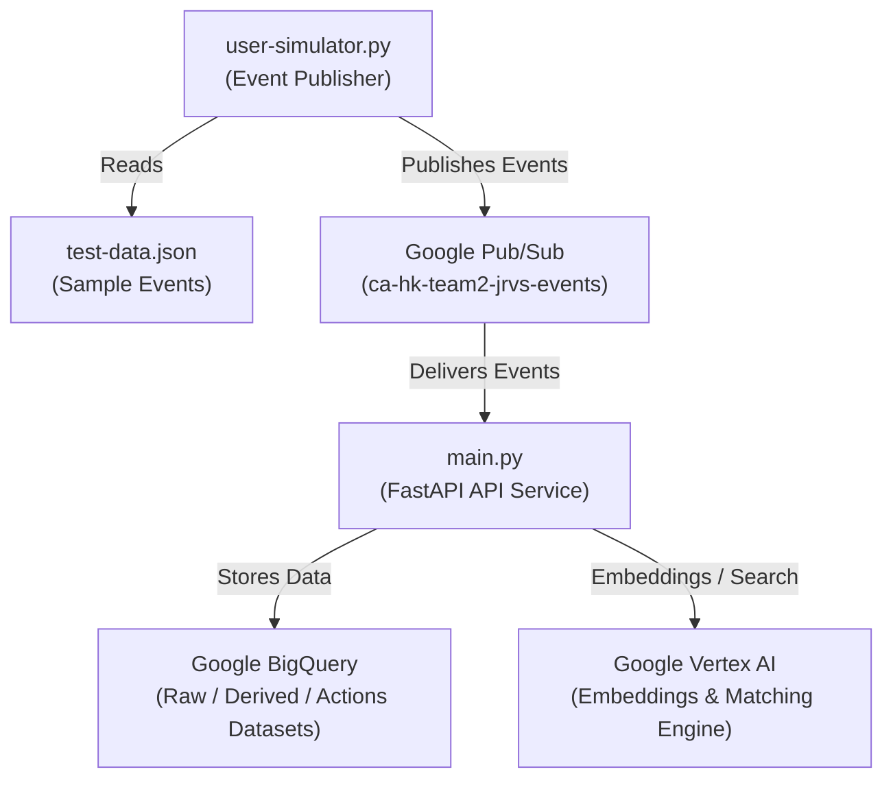

# Hackathon Event Ingestion & AI Pipeline

## Overview

This repository implements an event-driven pipeline for ingesting, processing, and searching workplace events (chat, calendar, email, drive, etc.) using Google Cloud services and FastAPI. It supports real-time event publishing, storage, and semantic search via embeddings.

**Key Features:**
- Ingests multi-source events via Google Pub/Sub.
- Processes and stores events in BigQuery (raw, derived, actions datasets).
- Supports semantic search using Google Vertex AI (embeddings and Matching Engine).
- Includes a user event simulator for testing with sample data.

---

## Architecture



---

## Key Components

- **main.py**  
  FastAPI service that ingests events from Pub/Sub, processes them, stores in BigQuery, and interacts with Vertex AI for embeddings and search.

- **user-simulator.py**  
  CLI tool to publish sample events from `test-data.json` to a Pub/Sub topic for testing the pipeline.

- **test-data.json**  
  Sample event data (JSONL format) from various sources (Google Chat, Calendar, Gmail, Drive, MS Teams, Outlook).

---

## Setup & Run

### Prerequisites

- Python 3.8+
- Google Cloud project with:
  - Pub/Sub, BigQuery, Vertex AI APIs enabled
  - Service account with appropriate permissions
- [gcloud CLI](https://cloud.google.com/sdk/docs/install)
- Required Python packages:
  ```
  pip install fastapi google-cloud-bigquery google-cloud-pubsub google-cloud-aiplatform uvicorn
  ```

### 1. Configure Environment

Set environment variables as needed (defaults are provided in `main.py`):

```sh
export PROJECT_ID="your-gcp-project"
export LOCATION="us-central1"
export BQ_DATASET_RAW="your_raw_dataset"
export BQ_DATASET_DERIVED="your_derived_dataset"
export BQ_DATASET_ACTIONS="your_actions_dataset"
export EMBEDDING_MODEL="gemini-embedding-001"
export EMBEDDING_DIM="3072"
export VERTEX_INDEX_ENDPOINT="projects/xxx/locations/us-central1/indexEndpoints/xxxx"
export VERTEX_INDEX_ID="your_index_id"
export VERTEX_INDEX_NAME="projects/xxx/locations/us-central1/indexes/xxxx"
export VERTEX_API_ENDPOINT="xxxx.us-central1-xxx.vdb.vertexai.goog"
```

Authenticate with Google Cloud:
```sh
gcloud auth application-default login
```

### 2. Start the FastAPI Service

```sh
uvicorn main:app --host 0.0.0.0 --port 8080
```

### 3. Publish Test Events

```sh
python user-simulator.py
```
This will read `test-data.json` and publish events to the configured Pub/Sub topic.

---

## Configuration

All configuration is via environment variables (see above).  
Key parameters:
- **PROJECT_ID**: GCP project ID
- **LOCATION**: GCP region (e.g., us-central1)
- **BQ_DATASET_RAW / DERIVED / ACTIONS**: BigQuery datasets
- **EMBEDDING_MODEL / EMBEDDING_DIM**: Vertex AI embedding model and vector size
- **VERTEX_INDEX_ENDPOINT / ID / NAME / API_ENDPOINT**: Vertex AI Matching Engine resources
- **VERIFY_PUBSUB_HEADER**: Set to `true` to enforce Pub/Sub header verification
- **CHAT_BOT_TOKEN**: Optional, for chat integrations

---

## Troubleshooting

- **Authentication Errors**  
  - Ensure Application Default Credentials are set (`gcloud auth application-default login`).
  - If running on Cloud Run, attach a service account with required roles.

- **Permission Denied**  
  - Grant the service account roles:
    - BigQuery: `roles/bigquery.jobUser` and dataset permissions
    - Vertex AI: `roles/aiplatform.user` and Matching Engine permissions

- **Resource Not Found**  
  - Double-check dataset/table names and Vertex resource names (project/region must match).

- **Missing Dependencies**  
  - Install required Python packages as listed above.

- **Pub/Sub Not Delivering Events**  
  - Verify topic and subscription names.
  - Check IAM permissions for Pub/Sub.

- **Vertex AI Errors**  
  - Ensure the embedding model and index are deployed and accessible in the correct region/project.

---

## License

Internal hackathon use only.  
Contact: [Gagan]

---